# LSDPals
Palettes for use with LSDj (using [LSDPatch](https://github.com/jkotlinski/lsdpatch)). 
Click on the title of the palette to download 

DM palettes provided by [DEFENSE MECHANISM](https://defensemech.com/) 
All other palettes provided by [Aquellex](https://soundcloud.com/aquellex) 

[ACID - Acid (N++)](https://github.com/urbster1/lsdpals/raw/master/lsdpal/ACID%20-%20Acid%20(N++).lsdpal) 
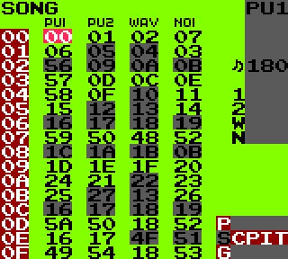 
[AQX2 - Aquellex v2.0](https://github.com/urbster1/lsdpals/raw/master/lsdpal/AQX2%20-%20Aquellex%20v2.0.lsdpal) 
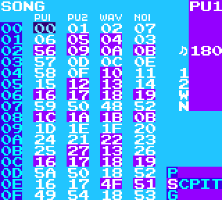 
[AUS - Australian (Special GBC Edition)](https://github.com/urbster1/lsdpals/raw/master/lsdpal/AUS%20%20-%20Australian%20(Special%20GBC%20Edition).lsdpal) 
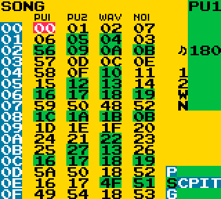 
[AZUR - Azure](https://github.com/urbster1/lsdpals/raw/master/lsdpal/AZUR%20-%20Azure.lsdpal) 
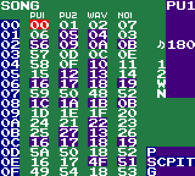 
[BASC - Basic (C64)](https://github.com/urbster1/lsdpals/raw/master/lsdpal/BASC%20-%20Basic%20(C64).lsdpal) 
 
[CALC - Calcium (Ableton)](https://github.com/urbster1/lsdpals/raw/master/lsdpal/CALC%20-%20Calcium%20(Ableton).lsdpal) 
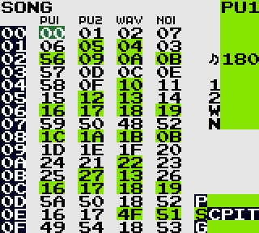 
[CARN - Carnival](https://github.com/urbster1/lsdpals/raw/master/lsdpal/CARN%20-%20Carnival.lsdpal) 
 
[CNDY - Candy](https://github.com/urbster1/lsdpals/raw/master/lsdpal/CNDY%20-%20Candy.lsdpal) 
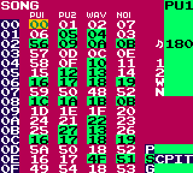 
[DM-BLUE](https://github.com/urbster1/lsdpals/raw/master/lsdpal/DM-BLUE.lsdpal) 
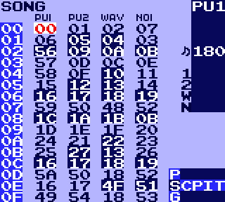 
[DM-COLD](https://github.com/urbster1/lsdpals/raw/master/lsdpal/DM-COLD.lsdpal) 
 
[DM-COOL](https://github.com/urbster1/lsdpals/raw/master/lsdpal/DM-COOL.lsdpal) 
 
[DM-DMGB](https://github.com/urbster1/lsdpals/raw/master/lsdpal/DM-DMGB.lsdpal) 
 
[DM-FIRE](https://github.com/urbster1/lsdpals/raw/master/lsdpal/DM-FIRE.lsdpal) 
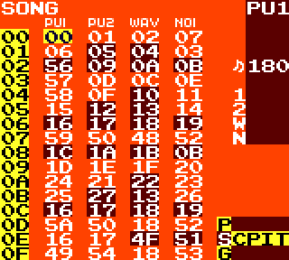 
[DM-MAN](https://github.com/urbster1/lsdpals/raw/master/lsdpal/DM-MAN.lsdpal) 
 
[DM-NITE](https://github.com/urbster1/lsdpals/raw/master/lsdpal/DM-NITE.lsdpal) 
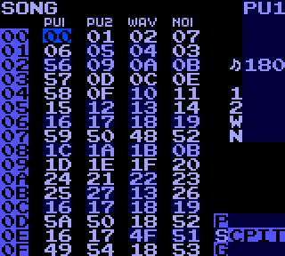 
[DM-RED](https://github.com/urbster1/lsdpals/raw/master/lsdpal/DM-RED.lsdpal) 
 
[DM-VERT](https://github.com/urbster1/lsdpals/raw/master/lsdpal/DM-VERT.lsdpal) 
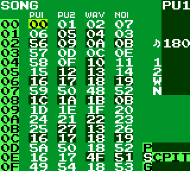 
[FIRE - Fire](https://github.com/urbster1/lsdpals/raw/master/lsdpal/FIRE%20-%20Fire.lsdpal) 
 
[HOT - Hotdog](https://github.com/urbster1/lsdpals/raw/master/lsdpal/HOTD.lsdpal) 
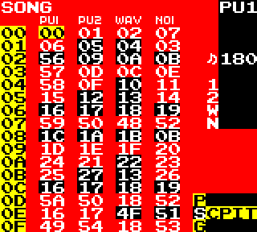 
[INDU - Industrial](https://github.com/urbster1/lsdpals/raw/master/lsdpal/INDU%20-%20Industrial.lsdpal) 
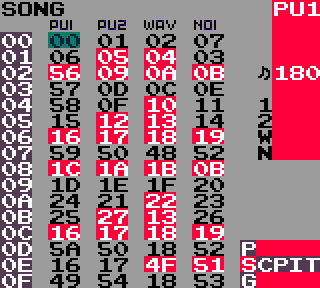 
[JAM -Jam](https://github.com/urbster1/lsdpals/raw/master/lsdpal/JAM%20-%20Jam.lsdpal) 
 
[LEOJ-leojisgood](https://github.com/urbster1/lsdpals/raw/master/lsdpal/LEOJ%20-%20leojisgood.lsdpal) 
 
[LIND-Lindenmorsen'sPalette](https://github.com/urbster1/lsdpals/raw/master/lsdpal/LIND%20-%20Lindenmorsen's%20Palette.lsdpal) 
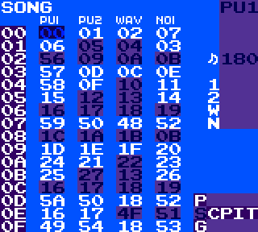 
[LOCK - Ratchet & Clank 2 HUD](https://github.com/urbster1/lsdpals/raw/master/lsdpal/LOCK%20-%20Ratchet%20&%20Clank%202%20HUD.lsdpal) 
 
[ORNG - Orange](https://github.com/urbster1/lsdpals/raw/master/lsdpal/ORNG%20-%20Orange.lsdpal) 
 
[PUR2 - Purple 2](https://github.com/urbster1/lsdpals/raw/master/lsdpal/PUR2%20-%20Purple%202.lsdpal) 
 
[PURP - Purple 1](https://github.com/urbster1/lsdpals/raw/master/lsdpal/PURP%20-%20Purple%201.lsdpal) 
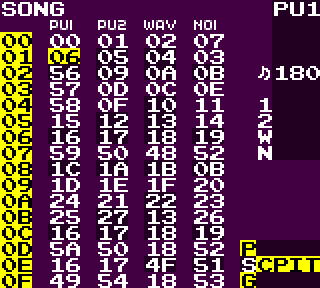 
[SUPR - Supernavy (N++)](https://github.com/urbster1/lsdpals/raw/master/lsdpal/SUPR%20-%20Supernavy%20(N++).lsdpal) 
 
[SWMP - Swamp](https://github.com/urbster1/lsdpals/raw/master/lsdpal/SWMP%20-%20Swamp.lsdpal) 
 
[UYA - Ratchet & Clank 3 HUD](https://github.com/urbster1/lsdpals/raw/master/lsdpal/UYA%20%20-%20Ratchet%20&%20Clank%203%20HUD.lsdpal) 
 
