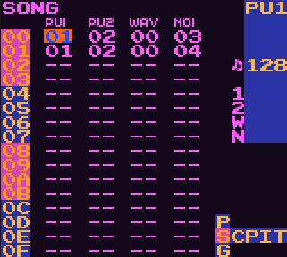
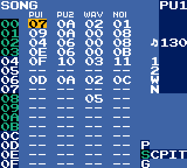
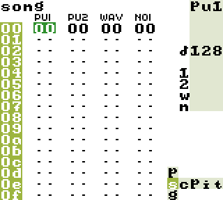

# LSDPals
Palettes for use with LSDj (using [LSDPatch](https://github.com/jkotlinski/lsdpatch/releases)). 
Click on the title of the palette to download 

DM palettes provided by [DEFENSE MECHANISM](https://defensemech.com/) 
PP palettes provided by [Pain Perdu](https://soundcloud.com/pain-perdu) 
Solarized Dark palettes provided by [Eiyeron](https://github.com/Eiyeron) 
MAG1 palette provided by [tobokegao](https://twitter.com/to6okegao) 
OPTI palette provided by Andrew Soper 
0D palettes provided by [0nlineDating](https://chipmusic.org/0nlineDating) 
QT palettes provided by [quantumtui](https://twitter.com/quantumtui) 
NORD palette provided by [Zeinok](https://twitter.com/Zein0k) 
Neato palette provided by [jkotlinski](https://github.com/jkotlinski) 
All other palettes provided by [Aquellex](https://soundcloud.com/aquellex) 

You might also be interested in the [LSDJ Palette Generator](https://defensemech.com/palette)

[0D-BLOO](https://github.com/psgcabal/lsdpals/raw/master/lsdpal/0D-BLOO.lsdpal)  
[0D-GREN](https://github.com/psgcabal/lsdpals/raw/master/lsdpal/0D-GREN.lsdpal)  
[0D-PNKO](https://github.com/psgcabal/lsdpals/raw/master/lsdpal/0D-PNKO.lsdpal)  
[0D-PNKR](https://github.com/psgcabal/lsdpals/raw/master/lsdpal/0D-PNKR.lsdpal)  
[0D-PRP3](https://github.com/psgcabal/lsdpals/raw/master/lsdpal/0D-PRP3.lsdpal)  
[0D-RGBY](https://github.com/psgcabal/lsdpals/raw/master/lsdpal/0D-RGBY.lsdpal)  
[0D-TRNS](https://github.com/psgcabal/lsdpals/raw/master/lsdpal/0D-TRNS.lsdpal)  
[0D-W98](https://github.com/psgcabal/lsdpals/raw/master/lsdpal/0D-W98.lsdpal)  
[ACID - Acid (N++)](https://github.com/psgcabal/lsdpals/raw/master/lsdpal/ACID%20-%20Acid%20(N++).lsdpal)  
[AQX2 - Aquellex v2.0](https://github.com/psgcabal/lsdpals/raw/master/lsdpal/AQX2%20-%20Aquellex%20v2.0.lsdpal)  
[AUS - Australian (Special GBC Edition)](https://github.com/psgcabal/lsdpals/raw/master/lsdpal/AUS%20%20-%20Australian%20(Special%20GBC%20Edition).lsdpal)  
[AZUR - Azure](https://github.com/psgcabal/lsdpals/raw/master/lsdpal/AZUR%20-%20Azure.lsdpal)  
[BASC - Basic (C64)](https://github.com/psgcabal/lsdpals/raw/master/lsdpal/BASC%20-%20Basic%20(C64).lsdpal)  
[CALC - Calcium (Ableton)](https://github.com/psgcabal/lsdpals/raw/master/lsdpal/CALC%20-%20Calcium%20(Ableton).lsdpal)  
[CARN - Carnival](https://github.com/psgcabal/lsdpals/raw/master/lsdpal/CARN%20-%20Carnival.lsdpal)  
[CNDY - Candy](https://github.com/psgcabal/lsdpals/raw/master/lsdpal/CNDY%20-%20Candy.lsdpal)  
[DM-BALL](https://github.com/psgcabal/lsdpals/raw/master/lsdpal/DM-BALL.lsdpal)  
[DM-BLUE](https://github.com/psgcabal/lsdpals/raw/master/lsdpal/DM-BLUE.lsdpal)  
[DM-BORT](https://github.com/psgcabal/lsdpals/raw/master/lsdpal/DM-BORT.lsdpal)  
[DM-COLD](https://github.com/psgcabal/lsdpals/raw/master/lsdpal/DM-COLD.lsdpal)  
[DM-COLR](https://github.com/psgcabal/lsdpals/raw/master/lsdpal/DM-COLR.lsdpal)  
[DM-COOL](https://github.com/psgcabal/lsdpals/raw/master/lsdpal/DM-COOL.lsdpal)  
[DM-CRES](https://github.com/psgcabal/lsdpals/raw/master/lsdpal/DM-CRES.lsdpal)  
[DM-DANK](https://github.com/psgcabal/lsdpals/raw/master/lsdpal/DM-DANK.lsdpal)  
[DM-DEAT](https://github.com/psgcabal/lsdpals/raw/master/lsdpal/DM-DEAT.lsdpal)  
[DM-DINK](https://github.com/psgcabal/lsdpals/raw/master/lsdpal/DM-DINK.lsdpal)  
[DM-DMGB](https://github.com/psgcabal/lsdpals/raw/master/lsdpal/DM-DMGB.lsdpal)  
[DM-DONK](https://github.com/psgcabal/lsdpals/raw/master/lsdpal/DM-DONK.lsdpal)  
[DM-FINE](https://github.com/psgcabal/lsdpals/raw/master/lsdpal/DM-FINE.lsdpal)  
[DM-FIRE](https://github.com/psgcabal/lsdpals/raw/master/lsdpal/DM-FIRE.lsdpal)  
[DM-FIRS](https://github.com/psgcabal/lsdpals/raw/master/lsdpal/DM-FIRS.lsdpal)  
[DM-FORK](https://github.com/psgcabal/lsdpals/raw/master/lsdpal/DM-FORK.lsdpal)  
[DM-GOOD](https://github.com/psgcabal/lsdpals/raw/master/lsdpal/DM-GOOD.lsdpal)  
[DM-JORG](https://github.com/psgcabal/lsdpals/raw/master/lsdpal/DM-JORG.lsdpal)  
[DM-MAN](https://github.com/psgcabal/lsdpals/raw/master/lsdpal/DM-MAN.lsdpal)  
[DM-MILD](https://github.com/psgcabal/lsdpals/raw/master/lsdpal/DM-MILD.lsdpal)  
[DM-MINT](https://github.com/psgcabal/lsdpals/raw/master/lsdpal/DM-MINT.lsdpal)  
[DM-MORF](https://github.com/psgcabal/lsdpals/raw/master/lsdpal/DM-MORF.lsdpal)  
[DM-NITE](https://github.com/psgcabal/lsdpals/raw/master/lsdpal/DM-NITE.lsdpal)  
[DM-PEPS](https://github.com/psgcabal/lsdpals/raw/master/lsdpal/DM-PEPS.lsdpal)  
[DM-PLUM](https://github.com/psgcabal/lsdpals/raw/master/lsdpal/DM-PLUM.lsdpal)  
[DM-ROOM](https://github.com/psgcabal/lsdpals/raw/master/lsdpal/DM-ROOM.lsdpal)  
[DM-SYNTH](https://github.com/psgcabal/lsdpals/raw/master/lsdpal/SYNTH.lsdpal)  
[DM-SWET](https://github.com/psgcabal/lsdpals/raw/master/lsdpal/DM-SWET.lsdpal)  
[DM-VERT](https://github.com/psgcabal/lsdpals/raw/master/lsdpal/DM-VERT.lsdpal)  
[DM-WMLN](https://github.com/psgcabal/lsdpals/raw/master/lsdpal/DM-WMLN.lsdpal)  
[FIRE - Fire](https://github.com/psgcabal/lsdpals/raw/master/lsdpal/FIRE%20-%20Fire.lsdpal)  
[HOT - Hotdog](https://github.com/psgcabal/lsdpals/raw/master/lsdpal/HOTD.lsdpal)  
[INDU - Industrial](https://github.com/psgcabal/lsdpals/raw/master/lsdpal/INDU%20-%20Industrial.lsdpal)  
[JAM -Jam](https://github.com/psgcabal/lsdpals/raw/master/lsdpal/JAM%20-%20Jam.lsdpal)  
[LEOJ-leojisgood](https://github.com/psgcabal/lsdpals/raw/master/lsdpal/LEOJ%20-%20leojisgood.lsdpal)  
[LIND-Lindenmorsen'sPalette](https://github.com/psgcabal/lsdpals/raw/master/lsdpal/LIND%20-%20Lindenmorsen's%20Palette.lsdpal)  
[LOCK - Ratchet & Clank 2 HUD](https://github.com/psgcabal/lsdpals/raw/master/lsdpal/LOCK%20-%20Ratchet%20&%20Clank%202%20HUD.lsdpal)  
[MAG1](https://github.com/psgcabal/lsdpals/raw/master/lsdpal/MAG1.lsdpal)  
[Neato](https://github.com/psgcabal/lsdpals/raw/master/lsdpal/neato.lsdpal)  
[NORD](https://github.com/psgcabal/lsdpals/raw/master/lsdpal/NORD.lsdpal)  
[ORNG - Orange](https://github.com/psgcabal/lsdpals/raw/master/lsdpal/ORNG%20-%20Orange.lsdpal)  
[OPTI](https://github.com/psgcabal/lsdpals/raw/master/lsdpal/OPTI.lsdpal)  
[PP-BLUE](https://github.com/psgcabal/lsdpals/raw/master/lsdpal/PP-BLUE.lsdpal)  
[PP-DUSK](https://github.com/psgcabal/lsdpals/raw/master/lsdpal/PP-DUSK.lsdpal)  
[PP-GRYF - Gryffindor](https://github.com/psgcabal/lsdpals/raw/master/lsdpal/PP-GRYF.lsdpal)  
[PP-HUFF - Hufflepuff](https://github.com/psgcabal/lsdpals/raw/master/lsdpal/PP-HUFF.lsdpal)  
[PP-LITE](https://github.com/psgcabal/lsdpals/raw/master/lsdpal/PP-LITE.lsdpal)  
[PP-RAVN - Ravenclaw](https://github.com/psgcabal/lsdpals/raw/master/lsdpal/PP-RAVN.lsdpal)  
[PP-SLYT - Slytherin](https://github.com/psgcabal/lsdpals/raw/master/lsdpal/PP-SLYT.lsdpal)  
[PUR2 - Purple 2](https://github.com/psgcabal/lsdpals/raw/master/lsdpal/PUR2%20-%20Purple%202.lsdpal)  
[PURP - Purple 1](https://github.com/psgcabal/lsdpals/raw/master/lsdpal/PURP%20-%20Purple%201.lsdpal)  
[QT-DETRITUS](https://github.com/psgcabal/lsdpals/raw/master/lsdpal/QT-DETRITUS.lsdpal)  
[QT-FALL](https://github.com/psgcabal/lsdpals/raw/master/lsdpal/QT-FALL.lsdpal)  
[QT-GREEN](https://github.com/psgcabal/lsdpals/raw/master/lsdpal/QT-GREEN.lsdpal)  
[QT-HOLLOW](https://github.com/psgcabal/lsdpals/raw/master/lsdpal/QT-HOLLOW.lsdpal)  
[QT-MONO](https://github.com/psgcabal/lsdpals/raw/master/lsdpal/QT-MONO.lsdpal)  
[QT-POND](https://github.com/psgcabal/lsdpals/raw/master/lsdpal/QT-POND.lsdpal)  
[SOLD -  Solarized Dark](https://github.com/psgcabal/lsdpals/raw/master/lsdpal/SOLD.lsdpal)  
[SLDB - Solarized Dark (BGB)](https://github.com/psgcabal/lsdpals/raw/master/lsdpal/SLDB.lsdpal)  
[SUPR - Supernavy (N++)](https://github.com/psgcabal/lsdpals/raw/master/lsdpal/SUPR%20-%20Supernavy%20(N++).lsdpal)  
[SWMP - Swamp](https://github.com/psgcabal/lsdpals/raw/master/lsdpal/SWMP%20-%20Swamp.lsdpal)  
[UYA - Ratchet & Clank 3 HUD](https://github.com/psgcabal/lsdpals/raw/master/lsdpal/UYA%20%20-%20Ratchet%20&%20Clank%203%20HUD.lsdpal)  
